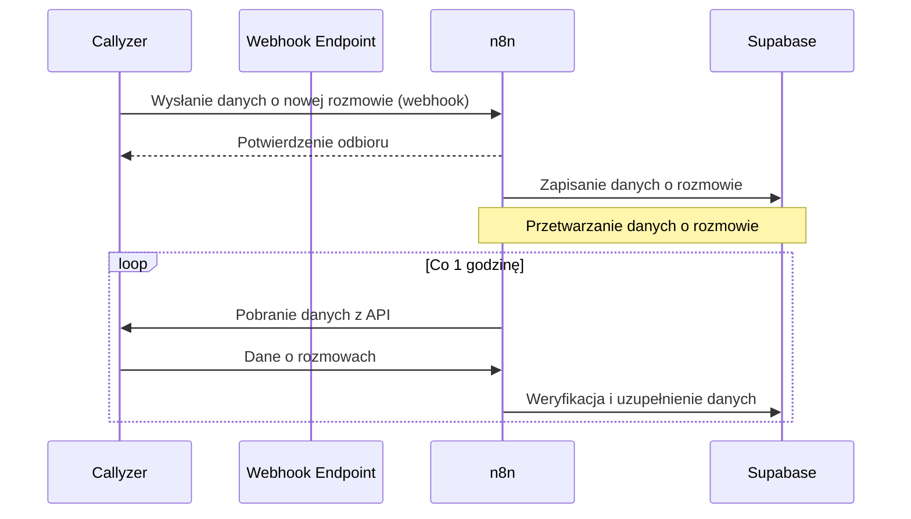

## Cel

Automatyczne pobieranie i przetwarzanie danych o rozmowach pracowników z systemu Callyzer w czasie rzeczywistym za pomocą webhooków, z dodatkową weryfikacją poprzez cykliczne odpytywanie API, w celu zapewnienia kompletności danych o rozmowach w systemie.

## Warunki początkowe

- System posiada skonfigurowane połączenie z API Callyzer
- System ma skonfigurowany webhook w panelu administracyjnym Callyzer
- System ma zdefiniowany interwał czasowy dla dodatkowej weryfikacji danych (domyślnie co 1 godzinę)
- W systemie są zarejestrowani aktywni doradcy z przypisanymi numerami telefonów
- System posiada endpoint do odbierania webhooków z Callyzer

## Wizualizacja działania

## Przebieg główny

### Dane wejściowe

- Webhook z danymi o rozmowie z Callyzer:
  - Dane pracownika (emp_name, emp_code, emp_country_code, emp_number, emp_tags)
  - Dane o rozmowie (id, client_name, client_number, duration, call_type, call_date, call_time, note, call_recording_url, crm_status, synced_at, modified_at)
- Parametry konfiguracyjne:
  - Secret do weryfikacji webhooków
  - Interwał czasowy weryfikacji API (domyślnie 1 godzina)
  - Maksymalna liczba prób przetworzenia (domyślnie 3)

### Kroki

1. Odbieranie webhooków z Callyzer:
   - Weryfikuj autentyczność webhooków za pomocą sekretu:
     - Gdy weryfikacja niepoprawna → odrzuć żądanie i zapisz informację o błędzie
     - Gdy weryfikacja poprawna → kontynuuj
   - Potwierdź odbiór webhooków
   - Zapisz dane do przetworzenia:
     - Gdy system jest obciążony → zapisz dane do późniejszego przetworzenia
     - Gdy system nie jest obciążony → przetwórz dane natychmiast

2. Przetwarzanie danych o rozmowie:
   - Mapuj statusy rozmów:
     - "Incoming" → "Przychodzące"
     - "Outgoing" → "Wychodzące"
     - "Missed" → "Nieodebrane"
     - "Rejected" → "Odrzucone"
   - Sprawdź czy rozmowa już istnieje w systemie:
     - Gdy istnieje → zaktualizuj dane
     - Gdy nie istnieje → dodaj nowy wpis
   - Spróbuj przypisać do leada:
     - Wyszukaj leada po numerze telefonu
     - Gdy znaleziono → zapisz w rejestrze rozmów leada
     - Gdy nie znaleziono → zapisz w tabeli nieprzetworzonych rozmów:
       - Numer telefonu
       - Data i czas rozmowy
       - Status
       - ID doradcy
       - Liczba prób przypisania
       - Data ostatniej próby

3. Cykliczna weryfikacja kompletności danych (co 1 godzinę):
   - Pobierz listę aktywnych doradców z ich numerami telefonów
   - Znajdź najstarszą datę ostatniej synchronizacji
   - Wykonaj zbiorcze zapytanie do API Callyzer:
     - Parametry:
       - emp_numbers: [lista_wszystkich_numerów_doradców]
       - synced_from: najstarsza_data_synchronizacji - 1 dzień (bufor bezpieczeństwa)
       - synced_to: aktualna_data
     - Obsługa błędów:
       - Gdy błąd autoryzacji → zapisz informację o błędzie i zakończ proces
       - Gdy timeout → zapisz informację o błędzie i spróbuj ponownie (max 3 próby)
       - Gdy sukces → przetwórz dane
   - Dla każdej pobranej rozmowy:
     - Sprawdź czy rozmowa już istnieje w systemie:
       - Gdy istnieje → pomiń
       - Gdy nie istnieje → przetwórz jak w kroku 2
   - Zaktualizuj datę ostatniej synchronizacji dla wszystkich doradców

4. Obsługa błędów i monitorowanie:
   - Monitoruj liczbę oczekujących webhooków:
     - Gdy liczba przekroczy ustalony próg → wyślij powiadomienie do administratora
   - Monitoruj czas przetwarzania webhooków:
     - Gdy średni czas przekroczy ustalony próg → wyślij powiadomienie do administratora
   - Monitoruj liczbę błędów:
     - Gdy liczba błędów przekroczy ustalony próg → wyślij powiadomienie do administratora
   - Generuj raport dzienny z podsumowaniem:
     - Liczba odebranych webhooków
     - Liczba przetworzonych webhooków
     - Liczba błędów
     - Średni czas przetwarzania

5. Weryfikacja nieprzetworzonych rozmów:
   - Pobierz rozmowy z liczbą prób mniejszą od maksymalnej
   - Dla każdej rozmowy:
     - Spróbuj ponownie przypisać do leada
     - Zwiększ licznik prób
     - Aktualizuj datę ostatniej próby

### Dane wyjściowe

- Zaktualizowane statystyki doradców
- Zaktualizowane rejestry rozmów leadów
- Lista nieprzetworzonych rozmów do ponownej weryfikacji
- Logi z przebiegu synchronizacji
- Raporty z monitorowania procesu

## Powiązania

- Ekrany: [[Ekran - Szczegóły leada]], [[Ekran - Wyświetlenie statystyk zespołu]]
- Procesy: [[Funkcja - Cykliczne pobieranie danych o rozmowach pracowników]]
- Dokumentacja API systemu Callyzer: [Link do dokumentacji API](https://developers.callyzer.co/)

## Potencjalne problemy i rozwiązania

1. **Utrata webhooków**:
   - Problem: Callyzer może nie być w stanie dostarczyć webhooków z powodu niedostępności naszego endpointu.
   - Rozwiązanie: Cykliczna weryfikacja przez API zapewnia kompletność danych nawet w przypadku utraty webhooków.

2. **Duplikaty danych**:
   - Problem: Ta sama rozmowa może być dostarczona przez webhook i przez API.
   - Rozwiązanie: Sprawdzanie unikalności rozmów przed zapisem (na podstawie ID rozmowy).

3. **Przeciążenie systemu**:
   - Problem: Duża liczba webhooków w krótkim czasie może przeciążyć system.
   - Rozwiązanie: Mechanizm kolejkowania z priorytetyzacją i kontrolą przepustowości.

4. **Błędy przetwarzania**:
   - Problem: Niektóre dane mogą być nieprawidłowe lub niekompletne.
   - Rozwiązanie: Mechanizm ponownych prób z maksymalną liczbą prób i logowaniem błędów.

5. **Opóźnienia w dostarczaniu danych**:
   - Problem: Dane mogą być dostarczone z opóźnieniem.
   - Rozwiązanie: Bufor bezpieczeństwa przy weryfikacji API (cofnięcie o 1 dzień).
