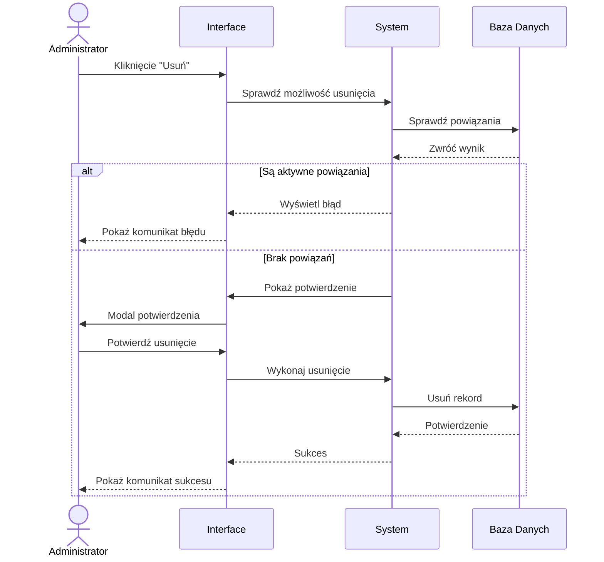

## Cel

Bezpieczne usunięcie instytucji bankowej z systemu, pod warunkiem braku aktywnych powiązań z innymi encjami.

## Warunki początkowe

- Użytkownik posiada rolę Administrator
- Instytucja bankowa istnieje w systemie
- Instytucja bankowa nie posiada aktywnych powiązań (sprawdzane przed aktywacją przycisku)

## Wizualizacja działania

## Przebieg główny

### Dane wejściowe

- ID instytucji bankowej do usunięcia

### Kroki

1. System sprawdza uprawnienia użytkownika:
   - Gdy brak uprawnień → "Brak uprawnień do usuwania instytucji bankowych"
   - Gdy ma uprawnienia → kontynuuj

2. System weryfikuje czy instytucja może zostać usunięta:
   - Sprawdź powiązane Cesje:
     - Gdy istnieją aktywne → "Nie można usunąć instytucji z aktywnymi cesjami"
   - Sprawdź powiązane UmowaKredytowa:
     - Gdy istnieją aktywne → "Nie można usunąć instytucji z aktywnymi umowami kredytowymi"
   - Gdy brak aktywnych powiązań → kontynuuj

3. System wyświetla modal potwierdzenia z komunikatem:
   - "Czy na pewno chcesz usunąć instytucję {Nazwa}?"
   - {Anuluj} → zamyka modal
   - {Usuń} → kontynuuj

4. System wykonuje miękkie usunięcie w bazie danych:
   - Ustawia deleted_at na aktualną datę i czas
   - Ustawia deleted_by na ID aktualnego użytkownika

5. System wyświetla komunikat: "Instytucja bankowa została usunięta"

6. System odświeża listę instytucji bankowych

### Dane wyjściowe

- Potwierdzenie usunięcia instytucji
- Zaktualizowana lista instytucji bankowych

## Powiązania

- Ekrany: [[Ekran - Lista Instytucji Bankowych]]
