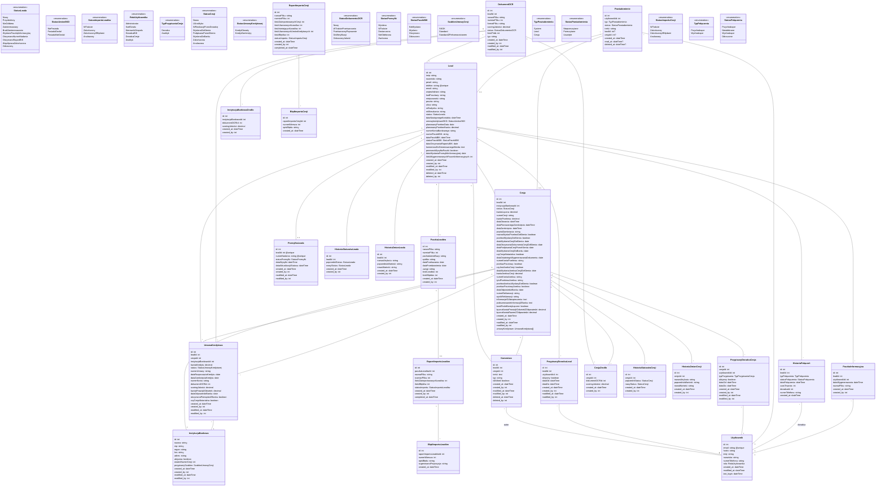

```mermaid
classDiagram

class Lead {
    id: int
    imię: string
    nazwisko: string
    pesel: string
    telefon: string @unique
    email: string
    województwo: string
    kodPocztowy: string
    miejscowość: string
    poczta: string
    ulica: string
    nrBudynku: string
    nrMieszkania: string
    status: StatusLeada
    dataNastępnegoKontaktu: dateTime
    umowykredytoweSKD: StatusUmówSKD
    planowanyPrzelewData: date
    planowanyPrzelewKwota: decimal
    numerKontaBankowego: string
    numerPaczkiBIK: string
    dataPaczkiBIK: dateTime
    statusPaczkiBIK: StatusPaczkiBIK
    dataOtrzymaniaRaportuBIK: date
    komentarzDoGenerowanegoWorda: text
    ponownaWysyłkaPaczki: boolean
    dataWysłaniaPrzesyłkiInformacyjnej: date
    ilośćWygenerowanychPaczekInformacyjnych: int
    created_at: dateTime
    created_by: int
    modified_at: dateTime
    modified_by: int
    deleted_at: dateTime
    deleted_by: int
}

class StatusLeada {
    <<enumeration>>
    Nowy
    Przydzielony
    NieOdbiera
    Zainteresowany
    BrakZainteresowania
    WysłanoPaczkęInformacyjną
    OtrzymanoNumerNadania
    OtrzymanoRaportBIK
    WspółpracaZakończona
    Odrzucony
}

class StatusUmówSKD {
    <<enumeration>>
    NiePosiada
    PosiadaDosłał
    PosiadaNieDosłał
}

class PaczkaLeadów {
    id: int
    nazwaPliku: string
    rozmiarPliku: int
    pochodzenieBazy: string
    spółka: string
    dataPrzekazania: date
    dataPrzedawnienia: date
    uwagi: string
    ilośćLeadów: int
    ilośćBłędów: int
    created_at: dateTime
    created_by: int
}

class RaportImportuLeadów {
    id: int
    paczkaLeadówId: int
    nazwaPliku: string
    rozmiarPliku: int
    ilośćZaimportowanychLeadów: int
    ilośćBłędów: int
    statusImportu: StatusImportuLeadów
    created_at: dateTime
    created_by: int
    completed_at: dateTime
}

class StatusImportuLeadów {
    <<enumeration>>
    WTrakcie
    Zakończony
    ZakończonyZBłędami
    Anulowany
}

class BłądImportuLeadów {
    id: int
    raportImportuLeadówId: int
    numerWiersza: int
    opisBłędu: string
    sugerowanaPropozycja: string
    created_at: dateTime
}

class Użytkownik {
    id: int
    email: string @unique
    hasło: string
    imię: string
    nazwisko: string
    numerTelefonu: string
    rola: RolaUżytkownika
    created_at: dateTime
    modified_at: dateTime
    last_login: dateTime
}

class RolaUżytkownika {
    <<enumeration>>
    Administrator
    SzefDziału
    KierownikZespołu
    DoradcaBIK
    DoradcaCesje
    Analityk
}

class Komentarz {
    id: int
    leadId: int
    cesjaId: int
    treść: text
    typ: string
    isEdited: boolean
    created_at: dateTime
    created_by: int
    modified_at: dateTime
    modified_by: int
    deleted_at: dateTime
    deleted_by: int
}

class PrzypisanyDoradcaLead {
    id: int
    leadId: int
    użytkownikId: int
    aktywny: boolean
    dataOd: dateTime
    dataDo: dateTime
    created_at: dateTime
    created_by: int
    modified_at: dateTime
    modified_by: int
}

class PrzypisanyDoradcaCesja {
    id: int
    cesjaId: int
    użytkownikId: int
    typPrzypisania: TypPrzypisaniaCesja
    aktywny: boolean
    dataOd: dateTime
    dataDo: dateTime
    created_at: dateTime
    created_by: int
    modified_at: dateTime
    modified_by: int
}

class TypPrzypisaniaCesja {
    <<enumeration>>
    Doradca
    Analityk
}

class Cesja {
    id: int
    leadId: int
    instytucjaBankowaId: int
    status: StatusCesji
    kwotaŁączna: decimal
    numerCesji: string
    kwotaPrzelewu: decimal
    dataOtwarcia: dateTime
    dataPlanowanegoZamknięcia: dateTime
    dataZamknięcia: dateTime
    powódZamknięcia: string
    możnaWysłaćPrzelewDoKlienta: boolean
    przelewWysłanyDoKlienta: boolean
    dataWysłaniaCesjiDoKlienta: date
    dataOtrzymaniaDokumentuCesjiOdKlienta: date
    dataPodpisaniaCesjiPrzezKlienta: date
    dataWysłaniaCesjiDoBanku: date
    czyCesjaNotarialna: boolean
    dataOstatniegoWygenerowaniaDokumentu: date
    numerKontaPrzelewu: string
    przekazPocztowy: boolean
    czyJestAneksCesji: boolean
    dataWysłaniaAneksuCesjiDoKlienta: date
    kwotaAneksuCesji: decimal
    numerKontaAneksu: string
    tytułPrzelewuAneksu: string
    przelewAneksuWysłanyDoKlienta: boolean
    przekazPocztowyAneksu: boolean
    dataOdpowiedziBanku: date
    numerReklamacji: string
    wynikReklamacji: string
    informacjeOUbezpieczeniu: text
    podsumowanieInformacjiZBanku: text
    bankPodałKwotyŁączne: boolean
    łącznaKwotaProwizjiIOdsetekZOdpowiedzi: decimal
    łącznaKwotaRazemZOdpowiedzi: decimal
    created_at: dateTime
    created_by: int
    modified_at: dateTime
    modified_by: int
    umowyKredytowe: UmowaKredytowa[]
}

class StatusCesji {
    <<enumeration>>
    Nowa
    UAnalityka
    WRealizacjiPrzezDoradcę
    WysłanaDoKlienta
    PodpisanaPrzezKlienta
    WysłanaDoBanku
    Zakończona
    Anulowana
}

class UmowaKredytowa {
    id: int
    leadId: int
    cesjaId: int
    instytucjaBankowaId: int
    kwotaKredytu: decimal
    status: StatusUmowyKredytowej
    numerUmowy: string
    dataRozpoczęciaKredytu: date
    dataZamknięciaKredytu: date
    numerKonta: string
    dokumentOCRId: int
    scoringJakości: decimal
    kwotaProwizjiIOdsetek: decimal
    dataOdpowiedziBanku: date
    otrzymanoPieniądzeZBanku: boolean
    czyCesjaNotarialna: boolean
    created_at: dateTime
    created_by: int
    modified_at: dateTime
    modified_by: int
}

class StatusUmowyKredytowej {
    <<enumeration>>
    KredytOtwarty
    KredytZamknięty
}

class InstytucjaBankowa {
    id: int
    nazwa: string
    nip: string
    regon: string
    krs: string
    adres: string
    aktywna: boolean
    ostatniNumerCesji: int
    przypisanySzablon: SzablonUmowyCesji
    created_at: dateTime
    created_by: int
    modified_at: dateTime
    modified_by: int
}

class DokumentOCR {
    id: int
    leadId: int
    nazwaPliku: string
    rozmiarPliku: int
    formatPliku: string
    scoringJakości: decimal
    status: StatusDokumentuOCR
    ilośćPrób: int
    typ: string
    created_at: dateTime
    created_by: int
    modified_at: dateTime
    modified_by: int
}

class StatusDokumentuOCR {
    <<enumeration>>
    Nowy
    WTrakciePrzetwarzania
    PrzetworzonyPoprawnie
    DoWeryfikacji
    OdrzuconyJakość
}

class InstytucjaBankowaZrodlo {
    id: int
    instytucjaBankowaId: int
    dokumentOCRId: int
    scoringJakości: decimal
    created_at: dateTime
    created_by: int
}

class CesjaZrodlo {
    id: int
    cesjaId: int
    dokumentOCRId: int
    scoringJakości: decimal
    created_at: dateTime
    created_by: int
}

class PrzesyłkaLeada {
    id: int
    leadId: int @unique
    numerNadania: string @unique
    statusPrzesyłki: StatusPrzesyłki
    dataWysyłki: dateTime
    dataAktualizacjiStatusu: dateTime
    created_at: dateTime
    created_by: int
    modified_at: dateTime
    modified_by: int
}

class StatusPrzesyłki {
    <<enumeration>>
    Wysłana
    WTrakcie
    Dostarczona
    NieOdebrana
    Zwrócona
}

class HistoriaStatusówLeada {
    id: int
    leadId: int
    poprzedniStatus: StatusLeada
    nowyStatus: StatusLeada
    created_at: dateTime
    created_by: int
}

class HistoriaStatusówCesji {
    id: int
    cesjaId: int
    poprzedniStatus: StatusCesji
    nowyStatus: StatusCesji
    created_at: dateTime
    created_by: int
}

class HistoriaZmianLeada {
    id: int
    leadId: int
    nazwaAtrybutu: string
    poprzedniaWartość: string
    nowaWartość: string
    created_at: dateTime
    created_by: int
}

class HistoriaZmianCesji {
    id: int
    cesjaId: int
    nazwaAtrybutu: string
    poprzedniaWartość: string
    nowaWartość: string
    created_at: dateTime
    created_by: int
}

class StatusPaczkiBIK {
    <<enumeration>>
    NieWysłano
    Wysłano
    Otrzymano
    Odrzucono
}

class SzablonUmowyCesji {
    <<enumeration>>
    SKOK
    Standard
    StandardZPełnomocnictwem
}

class Powiadomienie {
    id: int
    użytkownikId: int
    typ: TypPowiadomienia
    status: StatusPowiadomienia
    treść: string
    leadId: int?
    cesjaId: int?
    created_at: dateTime
    read_at: dateTime?
    deleted_at: dateTime?
}

class TypPowiadomienia {
    <<enumeration>>
    System
    Lead
    Cesja
}

class StatusPowiadomienia {
    <<enumeration>>
    Nieprzeczytane
    Przeczytane
    Usunięte
}

class RaportImportuCesji {
    id: int
    nazwaPliku: string
    rozmiarPliku: int
    ilośćZaimportowanychCesji: int
    ilośćUtworzonychLeadów: int
    ilośćIstniejącychLeadów: int
    ilośćUtworzonychUmówKredytowych: int
    ilośćBłędów: int
    statusImportu: StatusImportuCesji
    created_at: dateTime
    created_by: int
    completed_at: dateTime
}

class StatusImportuCesji {
    <<enumeration>>
    WTrakcie
    Zakończony
    ZakończonyZBłędami
    Anulowany
}

class BłądImportuCesji {
    id: int
    raportImportuCesjiId: int
    numerWiersza: int
    opisBłędu: string
    created_at: dateTime
}

class HistoriaPołączeń {
    id: int
    leadId: int
    typPołączenia: TypPołączenia
    statusPołączenia: StatusPołączenia
    dataPołączenia: dateTime
    czasTrwania: int
    doradcaId: int
    numerTelefonu: string
    created_at: dateTime
}

class TypPołączenia {
    <<enumeration>>
    Przychodzące
    Wychodzące
}

class StatusPołączenia {
    <<enumeration>>
    Przychodzące
    Nieodebrane
    Wychodzące
    Odrzucone
}

class PaczkaInformacyjna {
    id: int
    leadId: int
    użytkownikId: int
    dataWygenerowania: dateTime
    nazwaPliku: string
    created_at: dateTime
    created_by: int
}


Lead "1" -- "1" PaczkaLeadów
Lead "1" -- "*" Komentarz
Lead "1" -- "*" Cesja
Lead "1" -- "0..1" PrzesyłkaLeada
Lead "1" -- "*" UmowaKredytowa
Lead "1" -- "*" HistoriaPołączeń
Lead "1" -- "*" PaczkaInformacyjna
Komentarz "*" -- "1" Użytkownik : autor
Cesja "1" -- "*" UmowaKredytowa
Cesja "*" -- "1" InstytucjaBankowa
Cesja "1" -- "*" Komentarz
UmowaKredytowa "*" -- "1" InstytucjaBankowa
DokumentOCR "1" -- "*" InstytucjaBankowaZrodlo
DokumentOCR "1" -- "*" UmowaKredytowa
DokumentOCR "*" -- "1" Lead
DokumentOCR "1" -- "*" CesjaZrodlo
Cesja "1" -- "*" CesjaZrodlo
Cesja "1" -- "*" UmowaKredytowa
Lead "1" -- "*" PrzypisanyDoradcaLead
PrzypisanyDoradcaLead "*" -- "1" Użytkownik
Cesja "1" -- "*" PrzypisanyDoradcaCesja
PrzypisanyDoradcaCesja "*" -- "1" Użytkownik
Lead "1" -- "*" HistoriaStatusówLeada
Cesja "1" -- "*" HistoriaStatusówCesji
Lead "1" -- "*" HistoriaZmianLeada
Cesja "1" -- "*" HistoriaZmianCesji
Powiadomienie "*" -- "1" Użytkownik
Powiadomienie "*" -- "0..1" Lead
Powiadomienie "*" -- "0..1" Cesja
RaportImportuCesji "1" -- "*" BłądImportuCesji
PaczkaLeadów "1" -- "0..1" RaportImportuLeadów
RaportImportuLeadów "1" -- "*" BłądImportuLeadów
HistoriaPołączeń "*" -- "1" Użytkownik : doradca
PaczkaInformacyjna "*" -- "1" Użytkownik
```
